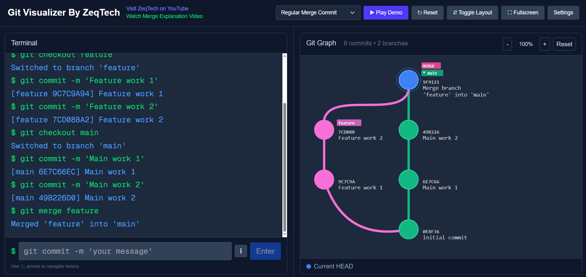

# Git Visualizer

[](https://zeqtech.github.io/git-visualizer/)

Git Visualizer is an interactive Next.js app for demonstrating and exploring common Git workflows visually. It combines a terminal-style command runner with a live commit graph so you can step through branching, merging, rebasing, tagging, resetting, and related operations and immediately see how the repository state changes.

Example deployment:

https://zeqtech.github.io/git-visualizer/

## Screenshot



Interactive terminal and live commit graph in the presentation preset.

## What It Does

- Executes Git-like commands inside the browser.
- Renders a live SVG commit graph with branches, merges, tags, and HEAD state.
- Includes guided demo flows for merges, rebases, tags, resets, and branching scenarios.
- Lets you tune graph presentation settings for demos and recordings.
- Includes a presentation preset for a larger, more readable default experience.

## Implemented Commands

- `git add <path>`
- `git commit -m "message"`
- `git branch`
- `git branch <name>`
- `git branch -d <name>`
- `git branch -D <name>`
- `git checkout <branch>`
- `git checkout -b <branch>`
- `git switch <branch>`
- `git switch -c <branch>`
- `git merge <branch>`
- `git merge --squash <branch>`
- `git rebase <branch>`
- `git squash <branch>`
- `git tag <name>`
- `git log`
- `git log --oneline`
- `git reset --hard HEAD~<n>`
- `git reset --soft HEAD~<n>`
- `git status`
- `git pull <remote> <branch>`

## Tech Stack

- Next.js 16
- React 19
- TypeScript
- Tailwind CSS 4
- Framer Motion
- Biome

## Local Development

1. Install dependencies:

```bash
npm install
```

2. Start the development server:

```bash
npm run dev
```

3. Open the app in your browser:

```text
http://localhost:3000
```

## Available Scripts

```bash
npm run dev
npm run build
npm run start
npm run lint
npm run format
```

## Project Structure

- `src/app/git-visualizer/page.tsx`: main UI, demos, settings, and command execution flow.
- `src/components/GitGraphComponent.tsx`: SVG graph renderer.
- `src/components/TerminalComponent.tsx`: terminal UI and command history.
- `src/lib/gitParser/*`: command parsing and validation.
- `src/lib/gitExecutor/*`: git operation simulation and state transitions.
- `src/lib/gitState.ts`: repository state model and graph construction helpers.
- `src/lib/demoCommands.ts`: built-in demo command sequences.

## Notes

- This project simulates Git behavior for learning and visualization. It is not a full Git implementation.
- Some commands intentionally support a focused subset of real Git syntax.
- Settings are stored in local storage so presentation preferences persist between sessions.
